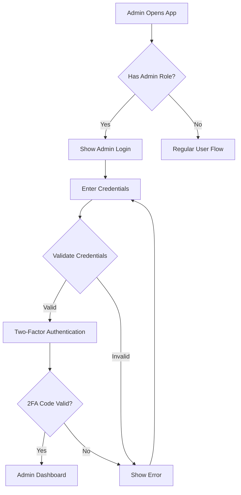
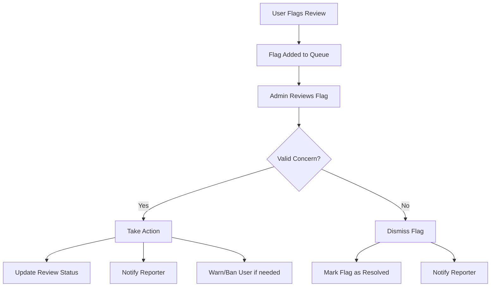
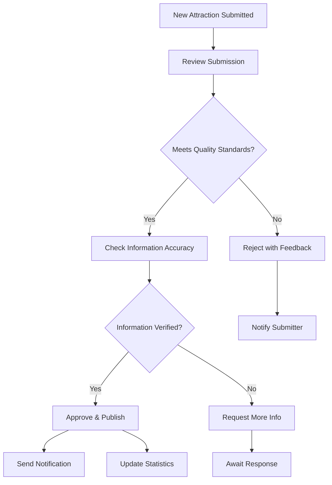
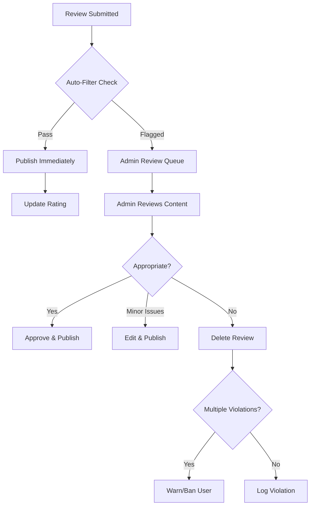
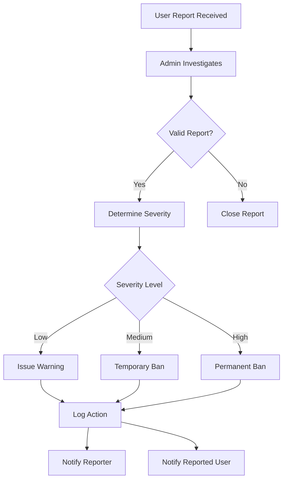
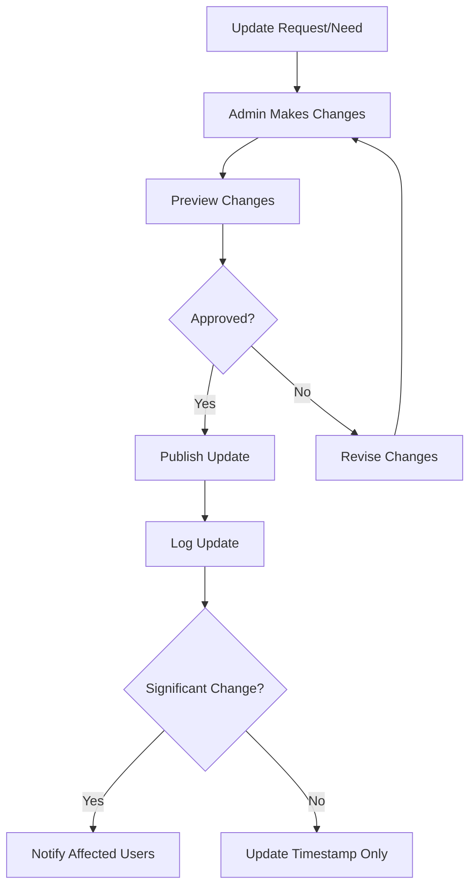

# 👨‍💼 Admin Flow - City Guide App

## 📋 Table of Contents

1. [Overview](#overview)
2. [Admin Authentication](#admin-authentication)
3. [Admin Dashboard](#admin-dashboard)
4. [Content Management](#content-management)
5. [Review Moderation](#review-moderation)
6. [User Management](#user-management)
7. [Notification System](#notification-system)
8. [Analytics & Reports](#analytics--reports)
9. [Admin Workflows](#admin-workflows)
10. [Security & Permissions](#security--permissions)

---

## 🎯 Overview

### Admin Role Purpose

The Admin role is responsible for maintaining the quality, accuracy, and integrity of the City Guide platform. Admins ensure users have access to current, reliable information and a positive community experience.

### Key Responsibilities

- ✅ Manage attraction listings (add, edit, remove)
- ✅ Moderate user reviews and ratings
- ✅ Manage events and promotions
- ✅ Send notifications to users
- ✅ Monitor user activities
- ✅ Generate reports and analytics
- ✅ Handle user complaints and reports
- ✅ Maintain data quality and accuracy

---

## 🔐 Admin Authentication

### 1. Admin Login Flow

```
┌─────────────────────────────────┐
│   City Guide Admin Portal       │
│                                 │
│   📧 Email: _______________     │
│   🔒 Password: ___________     │
│   ☐ Remember me                │
│                                 │
│   [Login as Admin]              │
│   Forgot password?              │
└─────────────────────────────────┘
```

**Login Process:**



**Authentication Steps:**

1. **Admin Portal Access**
    - URL: `/admin` or separate admin app
    - Admin-specific login screen
    - Enhanced security measures

2. **Credential Verification**
    - Email/Username validation
    - Password encryption check
    - Admin role verification

3. **Two-Factor Authentication (2FA)**
    - SMS or Email OTP
    - Authenticator app code
    - Backup codes option

4. **Session Management**
    - Secure token generation
    - Session timeout (30 minutes of inactivity)
    - Activity logging

---

## 📊 Admin Dashboard

### Dashboard Layout

```
╔════════════════════════════════════════════════════════════╗
║  🏙️ City Guide Admin          👤 Admin Name    [Logout]   ║
╠════════════════════════════════════════════════════════════╣
║                                                            ║
║  📊 OVERVIEW STATISTICS                                    ║
║  ┌──────────┬──────────┬──────────┬──────────┐           ║
║  │ 🏛️ Total │ 👥 Active│ ⭐ New   │ 🚨 Pending│           ║
║  │ 1,234    │ Users    │ Reviews  │ Reports  │           ║
║  │ Listings │ 5,678    │ 89       │ 12       │           ║
║  └──────────┴──────────┴──────────┴──────────┘           ║
║                                                            ║
║  📈 RECENT ACTIVITY                  [View All]           ║
║  • New attraction added: Lagos Museum (2 mins ago)        ║
║  • Review flagged: Inappropriate content (15 mins ago)    ║
║  • User reported: Spam reviews (1 hour ago)               ║
║                                                            ║
║  🔔 PENDING ACTIONS                  [View All]           ║
║  • 12 reviews awaiting moderation                         ║
║  • 5 new attractions pending approval                     ║
║  • 3 user reports to investigate                          ║
║                                                            ║
╚════════════════════════════════════════════════════════════╝
```

### Dashboard Sections

#### 1. Quick Stats Cards

```
┌─────────────────────────────────────────┐
│  📊 PLATFORM STATISTICS                 │
├─────────────────────────────────────────┤
│  Total Attractions:     1,234  [↑ 5%]  │
│  Total Users:           5,678  [↑ 12%] │
│  Total Reviews:        10,456  [↑ 8%]  │
│  Active Cities:            15  [→ 0%]  │
│  Avg Rating:              4.6★ [↑ 0.2] │
└─────────────────────────────────────────┘
```

#### 2. Navigation Menu

```
🏠 Dashboard
📍 Content Management
   ├─ Attractions
   ├─ Restaurants  
   ├─ Hotels
   ├─ Events
   └─ Cities
💬 Review Moderation
👥 User Management
🔔 Notifications
📊 Analytics & Reports
⚙️ Settings
🚪 Logout
```

---

## 📍 Content Management

### 1. Attractions Management

#### Main Attractions Screen

```
╔══════════════════════════════════════════════════════════╗
║  ATTRACTIONS MANAGEMENT                                  ║
╠══════════════════════════════════════════════════════════╣
║  [+ Add New Attraction]         🔍 Search: _________    ║
║  Filter: [All] [Pending] [Active] [Inactive]            ║
║  Sort by: [Recent] [Name] [Rating] [City]               ║
╟──────────────────────────────────────────────────────────╢
║  📊 Total: 1,234 | Active: 1,156 | Pending: 78          ║
╟──────────────────────────────────────────────────────────╢
║                                                          ║
║  🏛️ National Museum - Lagos                    ⭐ 4.8  ║
║     Status: ✅ Active | Category: Museum                ║
║     Created: Oct 1, 2025 | Reviews: 456                 ║
║     [👁️ View] [✏️ Edit] [🗑️ Delete] [📊 Stats]         ║
║  ─────────────────────────────────────────────────────   ║
║                                                          ║
║  🍽️ Jollof Kitchen - Abuja                    ⭐ 4.5  ║
║     Status: ⏳ Pending | Category: Restaurant           ║
║     Created: Oct 10, 2025 | Reviews: 23                 ║
║     [👁️ View] [✅ Approve] [❌ Reject] [✏️ Edit]       ║
║  ─────────────────────────────────────────────────────   ║
║                                                          ║
║  🏨 Luxury Hotel - Port Harcourt           ⭐ 4.9      ║
║     Status: ✅ Active | Category: Hotel                 ║
║     Created: Sep 15, 2025 | Reviews: 789                ║
║     [👁️ View] [✏️ Edit] [🗑️ Delete] [📊 Stats]         ║
╟──────────────────────────────────────────────────────────╢
║  Showing 1-20 of 1,234     [1] [2] [3] ... [62]        ║
╚══════════════════════════════════════════════════════════╝
```

#### Add/Edit Attraction Flow

```
Step 1: Basic Information
┌─────────────────────────────────────┐
│  Attraction Name: ____________      │
│  Category: [Select ▼]              │
│    □ Museum                         │
│    □ Restaurant                     │
│    □ Hotel                          │
│    □ Beach                          │
│    □ Park                           │
│    □ Shopping                       │
│    □ Entertainment                  │
│  Description: _________________    │
│  [...........................]      │
│  City: [Select ▼]                  │
│  [Next: Location →]                │
└─────────────────────────────────────┘

Step 2: Location Details
┌─────────────────────────────────────┐
│  Address: ____________________      │
│  Latitude: ___________________      │
│  Longitude: __________________      │
│  [📍 Pick on Map]                   │
│  [Show on Map Preview]              │
│  [← Back] [Next: Contact →]        │
└─────────────────────────────────────┘

Step 3: Contact Information
┌─────────────────────────────────────┐
│  Phone: +234 _________________      │
│  Email: ______________________      │
│  Website: ____________________      │
│  Opening Hours:                     │
│    Monday:    09:00 - 17:00        │
│    Tuesday:   09:00 - 17:00        │
│    Wednesday: 09:00 - 17:00        │
│    [...Configure all days]          │
│  [← Back] [Next: Media →]          │
└─────────────────────────────────────┘

Step 4: Images & Media
┌─────────────────────────────────────┐
│  Main Image: [Upload] [URL]        │
│  [📷 ____________]                  │
│                                     │
│  Gallery Images (Max 10):           │
│  [📷] [📷] [📷] [+]                │
│                                     │
│  Video URL (optional):              │
│  ____________________________       │
│  [← Back] [Next: Amenities →]      │
└─────────────────────────────────────┘

Step 5: Amenities & Features
┌─────────────────────────────────────┐
│  Select Available Amenities:        │
│  ☐ WiFi                             │
│  ☐ Parking                          │
│  ☐ Wheelchair Accessible            │
│  ☐ Air Conditioning                 │
│  ☐ Credit Cards Accepted            │
│  ☐ Outdoor Seating                  │
│  ☐ Family Friendly                  │
│                                     │
│  Price Range:                       │
│  ◯ $ ◯ $$ ◉ $$$ ◯ $$$$            │
│  [← Back] [Review & Save]          │
└─────────────────────────────────────┘

Step 6: Review & Publish
┌─────────────────────────────────────┐
│  PREVIEW                            │
│  ─────────────────────────          │
│  [Shows complete attraction card]   │
│                                     │
│  Status:                            │
│  ◉ Publish Immediately              │
│  ◯ Save as Draft                    │
│  ◯ Schedule: [Date/Time]            │
│                                     │
│  Notification:                      │
│  ☐ Notify users in this city        │
│                                     │
│  [← Back] [💾 Save] [🚀 Publish]   │
└─────────────────────────────────────┘
```

### 2. Events Management

```
╔══════════════════════════════════════════════════════════╗
║  EVENTS MANAGEMENT                                       ║
╠══════════════════════════════════════════════════════════╣
║  [+ Create New Event]           🔍 Search: _________    ║
║  Filter: [Upcoming] [Ongoing] [Past] [All]              ║
╟──────────────────────────────────────────────────────────╢
║                                                          ║
║  🎭 Lagos Fashion Week                                   ║
║     Date: Oct 20-25, 2025 | Location: Eko Hotel         ║
║     Status: ✅ Active | Attendees: 234                  ║
║     [👁️ View] [✏️ Edit] [📢 Promote] [📊 Stats]        ║
║  ─────────────────────────────────────────────────────   ║
║                                                          ║
║  🎵 Jazz Night at Terra Kulture                         ║
║     Date: Oct 15, 2025 | Location: Terra Kulture        ║
║     Status: ⏰ Upcoming | Attendees: 56                 ║
║     [👁️ View] [✏️ Edit] [📢 Promote]                   ║
╚══════════════════════════════════════════════════════════╝
```

**Event Creation Fields:**
- Event name and description
- Date and time (start/end)
- Location (link to attraction)
- Category (Music, Food, Sports, Culture, etc.)
- Ticket information (Free/Paid)
- Event organizer details
- Banner image
- Registration link
- Capacity limit

### 3. Cities Management

```
╔══════════════════════════════════════════════════════════╗
║  CITIES MANAGEMENT                                       ║
╠══════════════════════════════════════════════════════════╣
║  [+ Add New City]                                        ║
╟──────────────────────────────────────────────────────────╢
║                                                          ║
║  🌆 Lagos                                                ║
║     Attractions: 456 | Users: 2,345 | Status: ✅        ║
║     Description: Commercial capital of Nigeria...       ║
║     [✏️ Edit] [📊 Stats] [🗑️ Deactivate]               ║
║  ─────────────────────────────────────────────────────   ║
║                                                          ║
║  🌆 Abuja                                                ║
║     Attractions: 234 | Users: 1,234 | Status: ✅        ║
║     Description: Federal capital territory...           ║
║     [✏️ Edit] [📊 Stats] [🗑️ Deactivate]               ║
╚══════════════════════════════════════════════════════════╝
```

**City Information:**
- City name
- Country
- Description (200-500 words)
- Cover image
- Featured attractions
- Population
- Currency
- Language
- Time zone
- Best time to visit
- Fun facts

---

## 💬 Review Moderation

### Review Moderation Dashboard

```
╔══════════════════════════════════════════════════════════╗
║  REVIEW MODERATION                                       ║
╠══════════════════════════════════════════════════════════╣
║  [Pending: 12] [Flagged: 8] [All Reviews]               ║
║  Sort by: [Recent] [Rating] [Reports]                   ║
╟──────────────────────────────────────────────────────────╢
║                                                          ║
║  🚨 FLAGGED REVIEW (3 reports)                          ║
║  ───────────────────────────────────────────────        ║
║  User: @john_doe | Attraction: Jollof Kitchen           ║
║  Rating: ⭐ (1 star) | Date: Oct 10, 2025              ║
║                                                          ║
║  Review Text:                                            ║
║  "This place is terrible! [inappropriate content]..."   ║
║                                                          ║
║  Flagged for: ⚠️ Inappropriate Content                  ║
║  Reports: User1, User2, User3                           ║
║                                                          ║
║  Admin Actions:                                          ║
║  [✅ Approve] [✏️ Edit & Approve] [❌ Delete]           ║
║  [⚠️ Warn User] [🚫 Ban User] [👁️ View User Profile]  ║
║  ─────────────────────────────────────────────────────   ║
║                                                          ║
║  ✅ APPROVED REVIEW                                      ║
║  ───────────────────────────────────────────────        ║
║  User: @sarah_travels | Attraction: National Museum     ║
║  Rating: ⭐⭐⭐⭐⭐ (5 stars) | Date: Oct 11, 2025      ║
║                                                          ║
║  Review Text:                                            ║
║  "Amazing experience! The exhibits are well curated..." ║
║                                                          ║
║  [👁️ View] [✏️ Edit] [🗑️ Delete] [📌 Feature]         ║
╚══════════════════════════════════════════════════════════╝
```

### Review Moderation Actions

#### 1. Approve Review
```
Action: Review meets community guidelines
Process:
  ├─ Mark as "Approved"
  ├─ Publish to attraction page
  ├─ Update attraction rating
  ├─ Notify review author
  └─ Log admin action
```

#### 2. Edit & Approve
```
Action: Minor edits needed
Process:
  ├─ Open edit interface
  ├─ Make necessary changes
  ├─ Add edit note
  ├─ Publish edited version
  ├─ Notify user of changes
  └─ Log admin action with reason
```

#### 3. Delete Review
```
Action: Violates community guidelines
Process:
  ├─ Confirm deletion
  ├─ Select violation reason:
  │  □ Spam
  │  □ Inappropriate content
  │  □ Fake review
  │  □ Off-topic
  │  □ Harassment
  │  □ Other: _______
  ├─ Send notification to user
  ├─ Log violation
  ├─ Track user violations
  └─ Automatic ban after 3 violations
```

#### 4. Feature Review
```
Action: Highlight exceptional review
Process:
  ├─ Mark as "Featured"
  ├─ Display at top of reviews
  ├─ Add badge: "Staff Pick"
  ├─ Notify review author
  └─ Share on social media (optional)
```

### Review Flagging Workflow



---

## 👥 User Management

### User Management Dashboard

```
╔══════════════════════════════════════════════════════════╗
║  USER MANAGEMENT                                         ║
╠══════════════════════════════════════════════════════════╣
║  🔍 Search: ____________  Filter: [All] [Active] [Ban]  ║
║  Total Users: 5,678 | Active: 5,234 | Banned: 12        ║
╟──────────────────────────────────────────────────────────╢
║                                                          ║
║  👤 John Doe (@john_doe)                                 ║
║     Email: john@example.com | Joined: Jan 15, 2025      ║
║     Reviews: 23 | Ratings: 45 | Violations: 0           ║
║     Status: ✅ Active | Last Active: 2 hours ago        ║
║     [👁️ View Profile] [✏️ Edit] [⚠️ Warn] [🚫 Ban]     ║
║  ─────────────────────────────────────────────────────   ║
║                                                          ║
║  👤 Sarah Williams (@sarah_travels)                      ║
║     Email: sarah@example.com | Joined: Mar 20, 2025     ║
║     Reviews: 156 | Ratings: 289 | Violations: 0         ║
║     Status: ✅ Active | Badge: 🏆 Top Reviewer          ║
║     [👁️ View Profile] [✏️ Edit] [🏆 Awards]            ║
║  ─────────────────────────────────────────────────────   ║
║                                                          ║
║  👤 Spam User (@spam_bot)                                ║
║     Email: spam@test.com | Joined: Oct 10, 2025         ║
║     Reviews: 50 | Ratings: 100 | Violations: 5          ║
║     Status: 🚫 Banned | Reason: Multiple spam reviews   ║
║     [👁️ View Profile] [✅ Unban] [🗑️ Delete Account]   ║
╚══════════════════════════════════════════════════════════╝
```

### User Actions

#### 1. View User Profile

```
┌──────────────────────────────────────────┐
│  USER PROFILE: @john_doe                 │
├──────────────────────────────────────────┤
│  Personal Information:                   │
│    Name: John Doe                        │
│    Email: john@example.com               │
│    Phone: +234 123 456 7890              │
│    Joined: Jan 15, 2025                  │
│    Last Active: 2 hours ago              │
│                                          │
│  Activity Stats:                         │
│    Reviews Written: 23                   │
│    Attractions Rated: 45                 │
│    Favorites: 12                         │
│    Cities Visited: 5                     │
│                                          │
│  Engagement:                             │
│    Helpful Votes: 234                    │
│    Photos Uploaded: 67                   │
│    Comments: 89                          │
│                                          │
│  Moderation History:                     │
│    Warnings: 0                           │
│    Violations: 0                         │
│    Bans: 0                               │
│                                          │
│  Recent Activity:                        │
│    • Reviewed "Lagos Museum" (2h ago)    │
│    • Favorited "Jollof Kitchen" (5h ago) │
│    • Rated "Beach Resort" (1d ago)       │
└──────────────────────────────────────────┘
```

#### 2. Warn User

```
┌──────────────────────────────────────────┐
│  ISSUE WARNING TO: @john_doe             │
├──────────────────────────────────────────┤
│  Violation Type:                         │
│  ◯ Inappropriate Content                 │
│  ◯ Spam                                  │
│  ◯ Harassment                            │
│  ◯ Fake Reviews                          │
│  ◉ Other                                 │
│                                          │
│  Details:                                │
│  _________________________________       │
│  _________________________________       │
│  _________________________________       │
│                                          │
│  Warning Level:                          │
│  ◉ First Warning                         │
│  ◯ Second Warning                        │
│  ◯ Final Warning                         │
│                                          │
│  ☐ Send email notification               │
│  ☐ Restrict posting for 24 hours        │
│                                          │
│  [Cancel] [Send Warning]                 │
└──────────────────────────────────────────┘
```

#### 3. Ban User

```
┌──────────────────────────────────────────┐
│  BAN USER: @spam_bot                     │
├──────────────────────────────────────────┤
│  ⚠️ WARNING: This is a serious action    │
│                                          │
│  Reason for Ban:                         │
│  ◯ Multiple Violations                   │
│  ◉ Spam                                  │
│  ◯ Harassment                            │
│  ◯ Fake Reviews                          │
│  ◯ Inappropriate Content                 │
│  ◯ Other: _______________                │
│                                          │
│  Ban Duration:                           │
│  ◯ 7 Days                                │
│  ◯ 30 Days                               │
│  ◯ 90 Days                               │
│  ◉ Permanent                             │
│                                          │
│  Actions:                                │
│  ☑ Delete all reviews                    │
│  ☑ Remove all ratings                    │
│  ☐ Delete account                        │
│  ☑ Send notification                     │
│                                          │
│  Admin Notes:                            │
│  _________________________________       │
│                                          │
│  [Cancel] [⚠️ Confirm Ban]               │
└──────────────────────────────────────────┘
```

---

## 🔔 Notification System

### Notification Dashboard

```
╔══════════════════════════════════════════════════════════╗
║  NOTIFICATION CENTER                                     ║
╠══════════════════════════════════════════════════════════╣
║  [+ Create New Notification]                             ║
║  [📝 Scheduled] [📤 Sent] [📊 Analytics]                ║
╟──────────────────────────────────────────────────────────╢
║                                                          ║
║  📅 SCHEDULED NOTIFICATIONS                              ║
║  ───────────────────────────────────────────────        ║
║  🎭 Lagos Fashion Week Reminder                         ║
║     Send to: Users in Lagos (2,345 users)               ║
║     Scheduled: Oct 19, 2025 at 10:00 AM                 ║
║     [✏️ Edit] [🗑️ Delete] [📤 Send Now]                ║
║  ─────────────────────────────────────────────────────   ║
║                                                          ║
║  📤 RECENTLY SENT                                        ║
║  ───────────────────────────────────────────────        ║
║  🍽️ New Restaurant: Jollof Kitchen                     ║
║     Sent to: All users (5,678 users)                    ║
║     Sent: Oct 10, 2025 at 3:00 PM                       ║
║     Opened: 3,456 (60.8%) | Clicked: 1,234 (21.7%)     ║
║     [📊 View Stats] [📋 View Details]                   ║
╚══════════════════════════════════════════════════════════╝
```

### Create Notification Flow

```
Step 1: Notification Type
┌─────────────────────────────────────┐
│  SELECT NOTIFICATION TYPE           │
├─────────────────────────────────────┤
│  ◯ New Attraction                   │
│  ◯ Event Reminder                   │
│  ◯ Featured Content                 │
│  ◯ System Update                    │
│  ◉ Custom Message                   │
│                                     │
│  [Next: Target Audience →]         │
└─────────────────────────────────────┘

Step 2: Target Audience
┌─────────────────────────────────────┐
│  SELECT TARGET AUDIENCE             │
├─────────────────────────────────────┤
│  ◯ All Users (5,678 users)          │
│  ◉ Users in specific city:          │
│     [Select City ▼] Lagos           │
│     (2,345 users)                   │
│  ◯ Users who favorited:             │
│     [Select Category ▼]             │
│  ◯ Custom Segment:                  │
│     [Build Segment]                 │
│                                     │
│  Preview Audience: 2,345 users      │
│  [← Back] [Next: Content →]        │
└─────────────────────────────────────┘

Step 3: Notification Content
┌─────────────────────────────────────┐
│  NOTIFICATION CONTENT               │
├─────────────────────────────────────┤
│  Title (50 chars max):              │
│  _________________________________  │
│                                     │
│  Message (150 chars max):           │
│  _________________________________  │
│  _________________________________  │
│  _________________________________  │
│                                     │
│  Image (optional):                  │
│  [Upload] [URL]                     │
│                                     │
│  Action Button:                     │
│  Button Text: ________________      │
│  Link To: [Select ▼]               │
│                                     │
│  [Preview Notification]             │
│  [← Back] [Next: Schedule →]       │
└─────────────────────────────────────┘

Step 4: Schedule & Send
┌─────────────────────────────────────┐
│  SCHEDULE NOTIFICATION              │
├─────────────────────────────────────┤
│  Send Option:                       │
│  ◉ Send Immediately                 │
│  ◯ Schedule for later:              │
│     Date: [Oct 19, 2025]            │
│     Time: [10:00 AM]                │
│  ◯ Recurring:                       │
│     Frequency: [Daily ▼]            │
│                                     │
│  Delivery Settings:                 │
│  ☑ Push Notification                │
│  ☑ In-App Notification              │
│  ☐ Email                            │
│  ☐ SMS                              │
│                                     │
│  Target: 2,345 users in Lagos       │
│  Est. Cost: ₦0 (Free tier)          │
│                                     │
│  [← Back] [📤 Send / Schedule]     │
└─────────────────────────────────────┘
```

### Notification Templates

```
Template Library
┌─────────────────────────────────────┐
│  SAVED TEMPLATES                    │
├─────────────────────────────────────┤
│  📍 New Attraction Added            │
│  🎭 Event Starting Soon             │
│  ⭐ Featured Content                │
│  🔔 Weekly Digest                   │
│  🎉 Special Promotion               │
│  ⚠️ Maintenance Alert               │
│                                     │
│  [+ Create New Template]            │
└─────────────────────────────────────┘
```

---

## 📊 Analytics & Reports

### Analytics Dashboard

```
╔══════════════════════════════════════════════════════════╗
║  ANALYTICS & INSIGHTS                                    ║
╠══════════════════════════════════════════════════════════╣
║  Date Range: [Last 30 Days ▼]  [Export Report]         ║
╟──────────────────────────────────────────────────────────╢
║                                                          ║
║  📈 USER METRICS                                         ║
║  ┌──────────────────────────────────────────┐          ║
║  │  Total Users:        5,678  (↑ 12%)     │          ║
║  │  Active Users:       3,456  (↑ 8%)      │          ║
║  │  New Signups:          234  (↑ 15%)     │          ║
║  │  Retention Rate:     78.5%  (↑ 2%)      │          ║
║  └──────────────────────────────────────────┘          ║
║                                                          ║
║  📍 CONTENT METRICS                                      ║
║  ┌──────────────────────────────────────────┐          ║
║  │  Total Attractions:  1,234  (↑ 5%)      │          ║
║  │  Total Reviews:     10,456  (↑ 18%)     │          ║
║  │  Avg. Rating:          4.6  (↑ 0.2)     │          ║
║  │  New Listings:          45  (↑ 20%)     │          ║
║  └──────────────────────────────────────────┘          ║
║                                                          ║
║  🔥 TOP PERFORMING ATTRACTIONS                           ║
║  1. 🏛️ National Museum (Lagos)    - 1,234 views        ║
║  2. 🍽️ Jollof Kitchen (Abuja)     -   987 views        ║
║  3. 🏨 Luxury Hotel (Port H.)      -   856 views        ║
║                                                          ║
║  📊 ENGAGEMENT METRICS                                   ║
║  [View Detailed Charts]                                  ║
╚══════════════════════════════════════════════════════════╝
```

### Available Reports

#### 1. User Activity Report
- Daily/Weekly/Monthly active users
- User growth trends
- Registration sources
- User demographics (if available)
- Session duration
- Feature usage

#### 2. Content Performance Report
- Most viewed attractions
- Highest rated attractions
- Most reviewed attractions
- Category distribution
- City-wise breakdown
- Trending searches

#### 3. Review Analytics Report
- Total reviews submitted
- Average review length
- Rating distribution (1-5 stars)
- Review sentiment analysis
- Flagged vs. approved ratio
- Top reviewers

#### 4. Engagement Report
- User engagement rate
- Favorite additions
- Search queries
- Click-through rates
- Time spent in app
- Feature adoption

#### 5. Revenue Report (if applicable)
- Premium subscriptions
- Advertisement revenue
- Sponsored listings
- Total revenue trends

### Export Options

```
┌─────────────────────────────────────┐
│  EXPORT REPORT                      │
├─────────────────────────────────────┤
│  Report Type:                       │
│  [User Activity ▼]                  │
│                                     │
│  Date Range:                        │
│  From: [Oct 1, 2025]                │
│  To:   [Oct 31, 2025]               │
│                                     │
│  Format:                            │
│  ◉ PDF                              │
│  ◯ Excel (.xlsx)                    │
│  ◯ CSV                              │
│  ◯ JSON                             │
│                                     │
│  Include:                           │
│  ☑ Charts and Graphs                │
│  ☑ Detailed Tables                  │
│  ☑ Summary Statistics               │
│  ☐ Raw Data                         │
│                                     │
│  [Cancel] [📥 Export]               │
└─────────────────────────────────────┘
```

---

## 🔄 Admin Workflows

### Workflow 1: Handling New Attraction Submission



### Workflow 2: Review Moderation Process



### Workflow 3: User Report Investigation



### Workflow 4: Content Update Process



---

## 🔒 Security & Permissions

### Admin Permission Levels

```
┌─────────────────────────────────────────────────┐
│  ADMIN ROLES & PERMISSIONS                      │
├─────────────────────────────────────────────────┤
│  Super Admin (Full Access)                      │
│    ✅ All permissions                           │
│    ✅ Manage other admins                       │
│    ✅ System settings                           │
│    ✅ Delete critical content                   │
│    ✅ Access logs and analytics                 │
│                                                 │
│  Content Manager                                │
│    ✅ Add/Edit/Delete attractions               │
│    ✅ Manage events                             │
│    ✅ Upload media                              │
│    ❌ Ban users                                 │
│    ❌ System settings                           │
│                                                 │
│  Moderator                                      │
│    ✅ Review moderation                         │
│    ✅ Approve/Reject reviews                    │
│    ✅ Warn users                                │
│    ❌ Delete attractions                        │
│    ❌ System settings                           │
│                                                 │
│  Support Admin                                  │
│    ✅ View user profiles                        │
│    ✅ Send notifications                        │
│    ✅ View reports                              │
│    ❌ Modify content                            │
│    ❌ Ban users                                 │
└─────────────────────────────────────────────────┘
```

### Security Features

#### 1. Activity Logging
```
All admin actions are logged:
  - Timestamp
  - Admin ID
  - Action type
  - Affected content/user
  - IP address
  - Device information
```

#### 2. Two-Factor Authentication
- Required for all admin accounts
- SMS or authenticator app
- Backup codes provided

#### 3. Session Management
- Auto-logout after 30 minutes of inactivity
- Force logout on password change
- Single session enforcement (optional)

#### 4. Audit Trail
```
╔══════════════════════════════════════════════════════════╗
║  AUDIT LOG                                               ║
╠══════════════════════════════════════════════════════════╣
║  2025-10-12 14:30:25 | admin@example.com                ║
║  Action: Approved attraction "Lagos Museum"              ║
║  IP: 192.168.1.1 | Device: Chrome on Windows            ║
║  ─────────────────────────────────────────────────────   ║
║  2025-10-12 14:28:10 | moderator@example.com            ║
║  Action: Deleted review by @spam_user                    ║
║  Reason: Spam content                                    ║
║  IP: 192.168.1.5 | Device: Safari on macOS              ║
║  ─────────────────────────────────────────────────────   ║
║  2025-10-12 14:25:03 | admin@example.com                ║
║  Action: Banned user @fake_reviewer                      ║
║  Duration: Permanent | Reason: Multiple fake reviews    ║
║  IP: 192.168.1.1 | Device: Chrome on Windows            ║
╚══════════════════════════════════════════════════════════╝
```

---

## 🎯 Best Practices for Admins

### Content Management
1. ✅ Verify all information before approving
2. ✅ Use high-quality images
3. ✅ Keep descriptions accurate and updated
4. ✅ Respond to user reports promptly
5. ✅ Regular content audits

### Review Moderation
1. ✅ Be fair and consistent
2. ✅ Explain decisions when necessary
3. ✅ Look for patterns in user behavior
4. ✅ Preserve authentic negative reviews
5. ✅ Remove only guideline violations

### User Management
1. ✅ Issue warnings before bans
2. ✅ Document all actions
3. ✅ Give users chance to appeal
4. ✅ Recognize and reward top contributors
5. ✅ Maintain professional communication

### Notification Management
1. ✅ Don't spam users
2. ✅ Personalize when possible
3. ✅ Test before sending to all
4. ✅ Track engagement metrics
5. ✅ Respect user preferences

---

## 📞 Admin Support

### Getting Help
- 📚 Admin Documentation

[//]: # (- 💬 Admin Support Chat)

[//]: # (- 📧 admin-support@cityguide.app)

[//]: # (- 🎓 Admin Training Videos)

### Common Issues
- Forgot admin password → Use password reset
- Can't delete content → Check permissions
- Notification not sending → Check targeting
- Stats not updating → Refresh cache

---

*This guide is regularly updated. Last updated: October 2025*